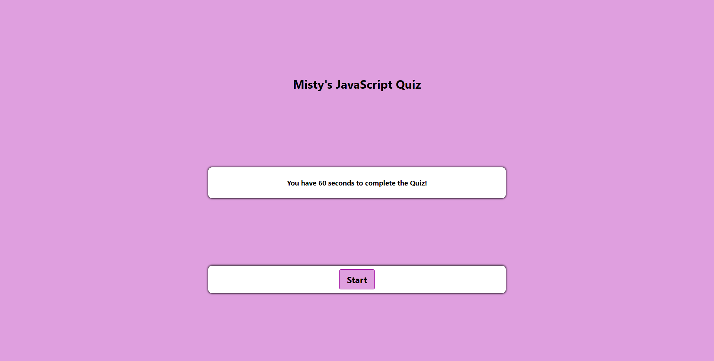

# Code Quiz

## Description
- My motivation for this project was to build a timed coding assessment that saves high scores  in order to gauge my progress of learning JavaScript fundamentals as compared to my peers. 
- This was accomplished through creating a start button that generates a series of questions, subtracting time for the clock if a question is answered incorrectly, indicating the game is over when the time reaches 0, and saving the user's initals and score. 

## Screenshot

## Link
https://mistwhit.github.io/code-quiz/

## References & Inspiration
Questions pulled from W3 Schools:
https://www.w3schools.com/quiztest/quiztest.asp?qtest=JS

Styling and Logic Inspired By Web Dev Simplified:
https://www.youtube.com/watch?v=riDzcEQbX6k&list=PLdfk8iKcUhtjv1_hzr-H1aPw2rhImNnW-